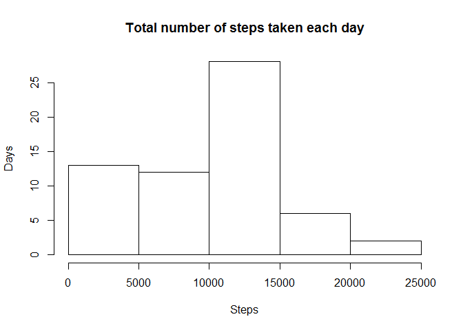
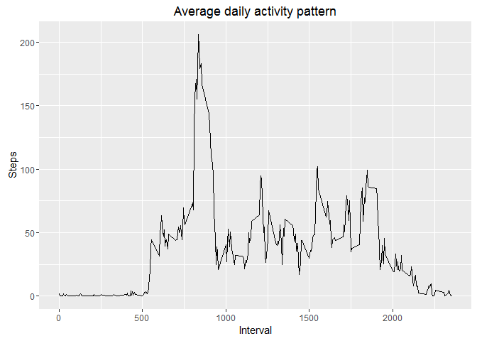
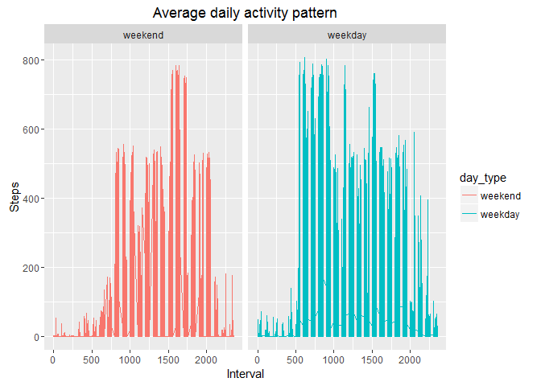

# Reproducible Research: Peer Assessment 1

```
## 
## Attaching package: 'dplyr'
```

```
## The following objects are masked from 'package:stats':
## 
##     filter, lag
```

```
## The following objects are masked from 'package:base':
## 
##     intersect, setdiff, setequal, union
```

```
## [1] "LC_COLLATE=English_United States.1252;LC_CTYPE=English_United States.1252;LC_MONETARY=English_United States.1252;LC_NUMERIC=C;LC_TIME=English_United States.1252"
```
## Loading and preprocessing the data

```r
input_data<-read.csv("activity.csv", stringsAsFactors = FALSE)
steps_by_date<-melt(tapply(input_data$steps, input_data$date, sum, na.rm=TRUE))
names(steps_by_date)<-c("date", "steps")
```

## What is mean total number of steps taken per day?

### Mean and Median ###

```r
mean(steps_by_date$steps)
```

```
## [1] 9354.23
```

```r
median(steps_by_date$steps)
```

```
## [1] 10395
```

## What is the average daily activity pattern?

### Interval with maximum steps###

```r
which.max(steps_by_intervals)
```

```
## 835 
## 104
```

## Imputing missing values
### Missing values number ###

```
## [1] 2304
```
### Replacing missing values###

```r
filled_missing<-mutate(group_by(input_data, interval), steps=ifelse(is.na(steps), mean(steps, na.rm=TRUE), steps))
weekends=c("Sat", "Sun")
factor_lables=c("weekend", "weekday")
data_day_type<-mutate(filled_missing, day_type=factor(ifelse(weekdays(as.POSIXct(date, format="%Y-%m-%d"), abbreviate=TRUE) %in% weekends, "weekend", "weekday"), levels = factor_lables))
```
## Are there differences in activity patterns between weekdays and weekends?
<!-- -->
